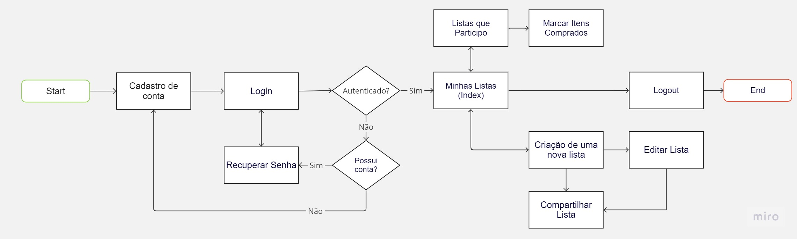
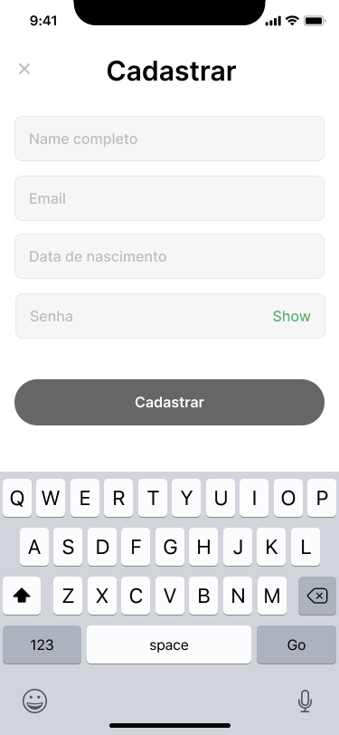
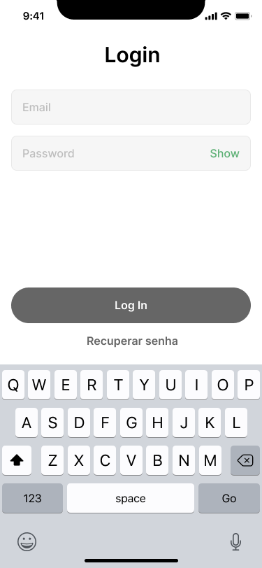
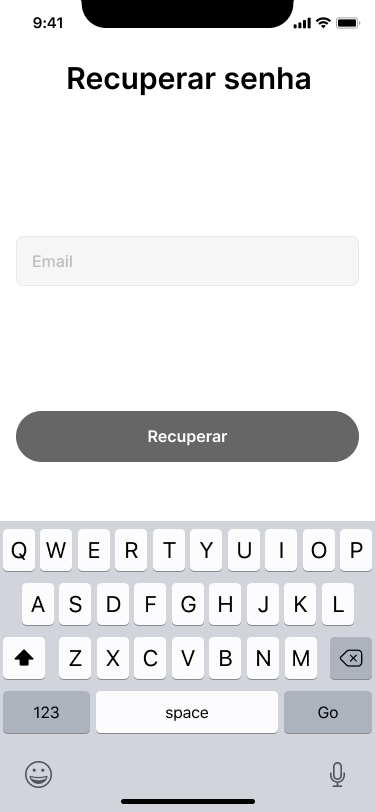
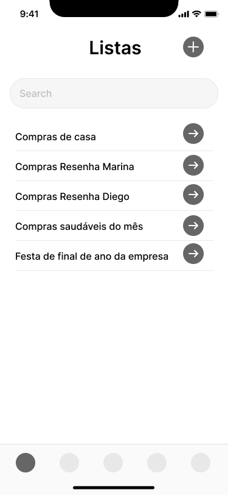
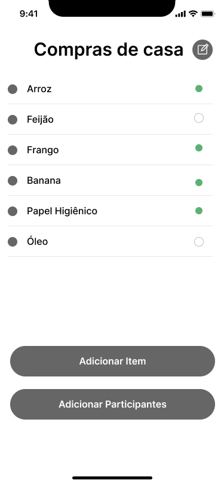
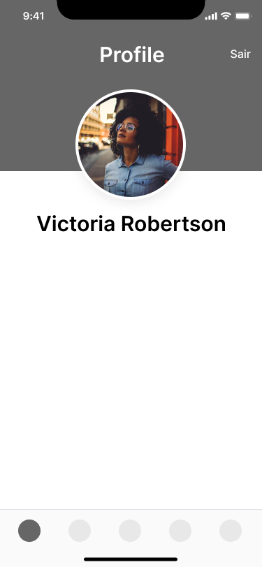
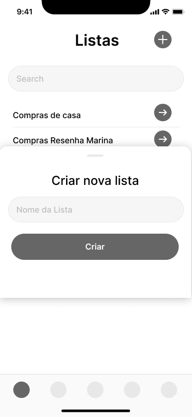
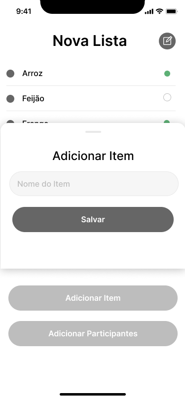
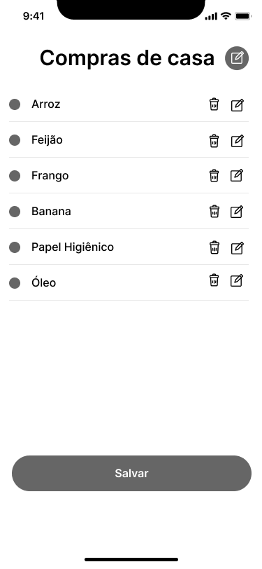

# Projeto de Interface

Pré-requisitos: <a href="2-Especificação do Projeto.md"> Documentação de Especificação</a>

Visão geral da interação do usuário pelas telas do sistema e protótipo interativo das telas com as funcionalidades que fazem parte do sistema (wireframes).

## Diagrama de Fluxo

O fluxo de usuário (User Flow) mostra como o será a navegação pelas páginas do App e Web.

# Wireframes

## Mobile

### Tela Cadastro

### Tela Login

### Tela Recuperar Senha

### Tela Home

### Tela Lista

### Tela Logout

### Tela Criar Lista

### Tela Adicionar Item

### Tela Adicionar Participante

### Tela Editar Item

