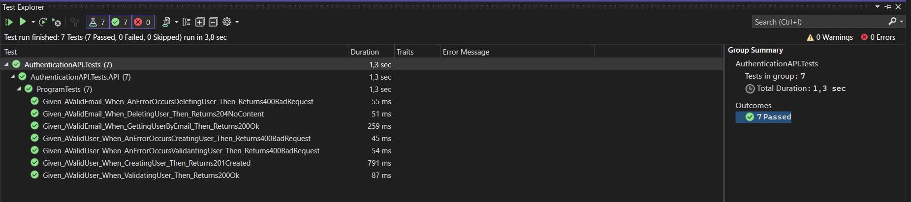

# Registro de Testes de Software

Pré-requisitos: <a href="3-Projeto de Interface.md"> Projeto de Interface</a>, <a href="8-Plano de Testes de Software.md"> Plano de Testes de Software</a>

Relatório com as evidências dos testes de software realizados no sistema pela equipe, baseado em um plano de testes pré-definido.

## Testes de Unidade - API Autenticação

## Avaliação

### Testes de Unidade - Endpoint Autenticação

Os testes propostos foram bem-sucedidos, pois todos os cenários especificados nos plano de testes foram verificados com sucesso, e as asserções definidas nas afirmações (Assert) não geraram erros. Portanto, podemos afirmar que os testes foram executados com êxito, validando o comportamento esperado da aplicação em relação à autenticação de usuários.

# Testes de integração Frontend

# Registro de Testes de Usabilidade

## 1. Login e Cadastro:

### Testar Login:
- **Resultado:** O login foi realizado com sucesso, redirecionando para a página correta.
- **Validações:** As validações foram eficazes, exibindo alertas ao tentar fazer login sem preencher todos os campos e impedindo o login com informações inválidas.

### Testar Cadastro:
- **Resultado:** O cadastro foi bem-sucedido, redirecionando para a página correspondente.
- **Validações:** Alertas foram exibidos corretamente em caso de campos não preenchidos e e-mail fora do padrão. O CPF cadastrado foi validado com sucesso.

### Testar Recuperar Senha:
- **Resultado:** A redefinição de senha ocorreu conforme esperado, com redirecionamento adequado.
- **Validações:** Alertas foram exibidos corretamente para campos não preenchidos e usuário não existente. A mensagem de segurança foi validada.

## 2. Criar Lista:

### Testar Exibição do Modal:
- **Resultado:** O modal "Criar Lista" foi aberto corretamente, com campos visíveis e funcionais.
  
### Testar Criação de Lista:
- **Resultado:** A lista foi criada com sucesso, com chamada correta da API e fechamento adequado do modal.
- **Validações:** Alertas foram exibidos corretamente ao tentar criar uma lista sem nome.

## 3. Itens da Lista:

### Testar Exibição de Itens:
- **Resultado:** A lista de itens foi exibida corretamente, e o botão "Adicionar Item" abriu o modal esperado.
- **Testar Edição e Exclusão de Itens:**
  - **Resultado:** A edição de itens foi bem-sucedida, refletindo corretamente as alterações. A exclusão removeu o item da lista conforme esperado.

## 4. Adicionar Participantes:

### Testar Adição de Participante:
- **Resultado:** O modal "Adicionar Participante" foi aberto corretamente, e um participante foi adicionado à lista.

### Testar Logout:
- **Resultado:** O logout redirecionou para a página correta.
- **Validações:** O modal "Adicionar Participante" foi aberto corretamente. A adição de um participante foi testada, e as mensagens de sucesso ou erro foram verificadas.
