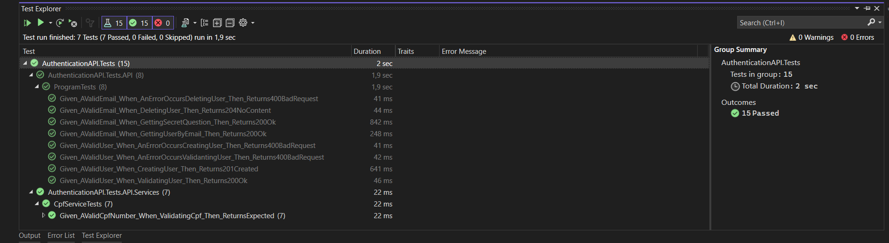

# Registro de Testes de Software

Pré-requisitos: <a href="3-Projeto de Interface.md"> Projeto de Interface</a>, <a href="8-Plano de Testes de Software.md"> Plano de Testes de Software</a>

Relatório com as evidências dos testes de software realizados no sistema pela equipe, baseado em um plano de testes pré-definido.

## Testes de Unidade - API Autenticação

## Avaliação

### Testes de Unidade - Endpoint Autenticação

Os testes propostos foram bem-sucedidos, pois todos os cenários especificados nos plano de testes foram verificados com sucesso, e as asserções definidas nas afirmações (Assert) não geraram erros. Portanto, podemos afirmar que os testes foram executados com êxito, validando o comportamento esperado da aplicação em relação à autenticação de usuários.

<!-- Discorra sobre os resultados do teste. Ressaltando pontos fortes e fracos identificados na solução. Comente como o grupo pretende atacar esses pontos nas próximas iterações. Apresente as falhas detectadas e as melhorias geradas a partir dos resultados obtidos nos testes.

> **Links Úteis**:
> - [Ferramentas de Test para Java Script](https://geekflare.com/javascript-unit-testing/) -->